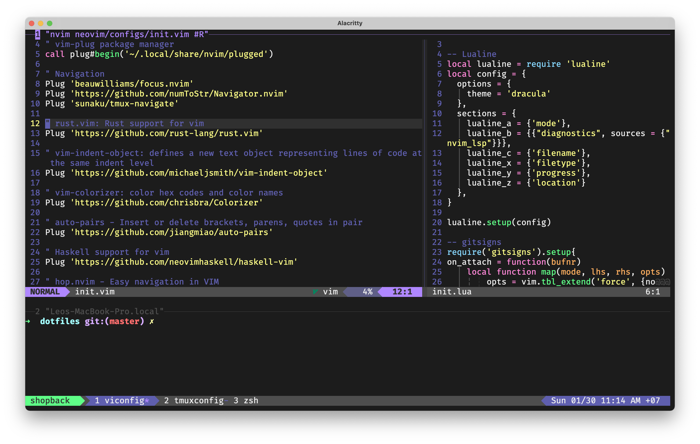

# vunguyenhung dotfiles
## Prerequisite
- macOS Mojave or above

## Preview

## Install
### Change directory to each sub-directory and follow its README.md
1. Install [System Packages](./system-packages)
2. Install [Alacritty](./alacritty)
3. Install [Zsh](./zsh)
4. Install [Tmux](./tmux)
5. Install [Neovim](./neovim)
6. Setting [System Preferences](./system-preferences)
