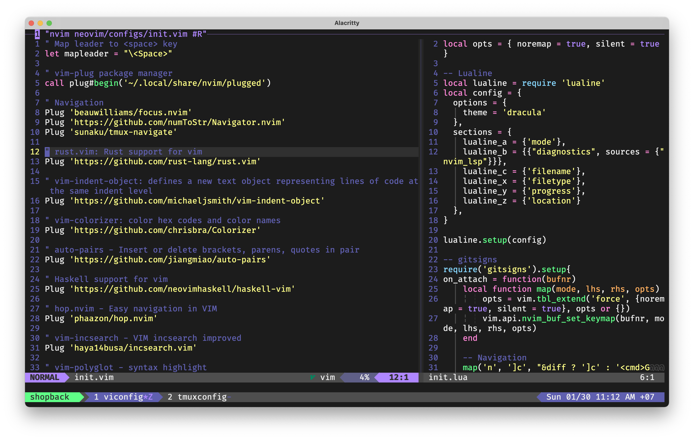

# vunguyenhung dotfiles

## Screenshot

## Install
### Change directory to each sub-directory and follow their README.md
1. Install [iterm](./iterm)
2. Install [homebrew](./homebrew)
3. Install [zsh](./zsh)
4. Install [tmux](./tmux)
5. Install [neovim](./neovim)
6. Setting [System Preferences](./system-preferences)
